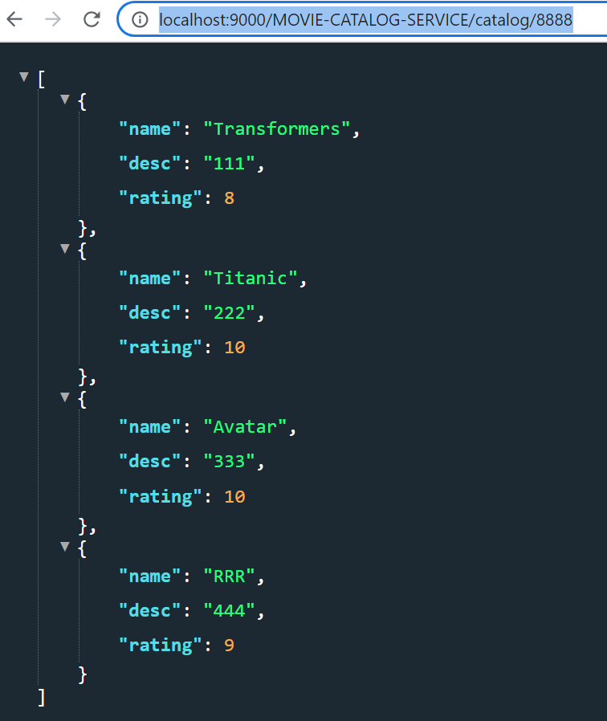

# Patterns in spring cloud environment

1) Load Balancing, Scaling MicroServices - Registry & Discovery server for Service Discovery,
2) Fault Tolerance & Resilience - Timeout, Circuit Breaker, retry, ratelimiter - resilience4j, Hystriz (deprecated Netflix dependency)
3) Configuration

Changing port, profile using VM options:
-Dserver.port=8084 -Dspring.profiles.active=dev

java -jar -Dspring.profiles.active=profilename XXX.jar

mvn spring-boot:run -Dspring-boot.run.profiles=foo,bar

# docker-compose is a CLI (command line interface) that's installed along with docker desktop

docker-compose up

# http://localhost:8082/ratings/8888
ratings-data-service

# http://localhost:8083/movies/111
movie-info-service

# http://localhost:8081/catalog/8888
movie-catalog-service

# http://localhost:9000/MOVIE-CATALOG-SERVICE/catalog/8888

# http://localhost:8761/
Eureka Registry Discovery server

# http://localhost:8888/actuator/configprops
Config Server: actuator

# profiles from config server:

